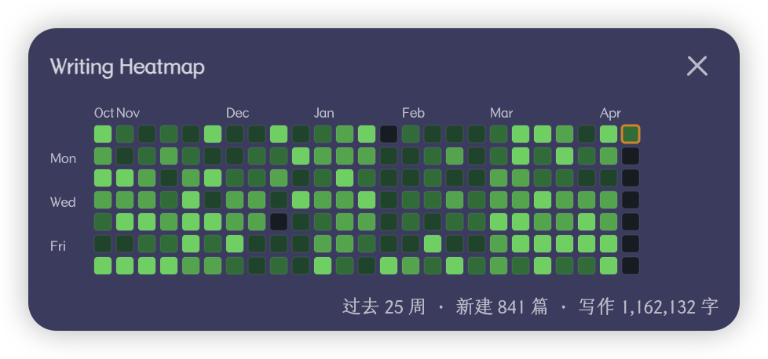

# Obsidian Writing Heatmap

A GitHub-style heatmap plugin for [Obsidian](https://obsidian.md) that visualizes your daily writing activity — notes created and words written — to help you build and maintain a consistent writing habit.

一个 Obsidian 插件，以 GitHub 风格的热力图展示你的每日写作活动（笔记数 & 字数），帮助你养成持续写作的习惯。



---

## Features | 功能

- **Daily note count** — Track how many notes you create each day
  **每日笔记数** — 统计每天创建的笔记数量

- **Daily word count** — Track total character count of notes created each day (updates in real-time as you edit)
  **每日字数** — 统计每天创建的笔记的总字数（编辑后实时更新）

- **GitHub-style heatmap** — 25 weeks (half a year) of activity at a glance, with adaptive color scaling
  **GitHub 风格热力图** — 一览过去 25 周的写作活动，颜色深浅自适应

- **Status bar** — Always visible today's stats: `📝 3 · ✍️ 1,240`
  **状态栏** — 底部常驻显示今日数据

- **Tooltip** — Hover over any cell to see: date, notes created, words written
  **悬停提示** — 鼠标移到方格上即可查看详细数据

- **Daily note navigation** — Click any cell to jump to that day's daily note
  **日记跳转** — 点击方格直接打开对应日期的日记

- **Folder exclusion** — Glob patterns & whitelist mode to control which files are counted
  **文件夹排除** — 支持 glob 模式和白名单，灵活控制统计范围

- **Light & dark theme** — Follows Obsidian's theme with GitHub's green color palette
  **深浅主题** — 自动跟随 Obsidian 主题切换配色

## Settings | 设置

| Setting | Description |
|---------|-------------|
| **Exclude patterns** | Glob patterns for files/folders to exclude (e.g. `templates/**`, `**/archive/**`) |
| **Include patterns** | Whitelist mode — if set, only matching files are tracked |
| **Count code blocks** | Toggle whether code block characters count toward word count (default: off) |
| **Color by** | Color cells by word count (default) or note count |
| **Rebuild index** | Force a full rescan if data seems incorrect |

## How word count works | 字数统计规则

The plugin strips Markdown syntax before counting characters:

- Frontmatter (`---...---`) is removed
- Code blocks and inline code are removed (unless enabled in settings)
- Image embeds, link URLs, and HTML tags are removed
- Markdown symbols (`# * _ ~ > |` etc.) are removed
- Remaining characters (Chinese characters, English letters, numbers, etc.) are counted

This means "Hello 世界" = 7 characters. Optimized for Chinese-first writing with mixed English.

## Installation | 安装

### From Community Plugins (Recommended)

1. Open Obsidian Settings → Community plugins → Browse
2. Search for **Writing Heatmap**
3. Click Install, then Enable

### Manual Installation

1. Download `main.js`, `manifest.json`, and `styles.css` from the [latest release](https://github.com/0xAiKang/obsidian-writing-heatmap/releases/latest)
2. Create a folder `obsidian-writing-heatmap` in your vault's `.obsidian/plugins/` directory
3. Copy the three files into that folder
4. Restart Obsidian and enable the plugin in Settings → Community plugins

## Development | 开发

```bash
# Clone the repo
git clone https://github.com/0xAiKang/obsidian-writing-heatmap.git

# Install dependencies
npm install

# Development mode (watch)
npm run dev

# Production build
npm run build
```


## License

[MIT](LICENSE)
